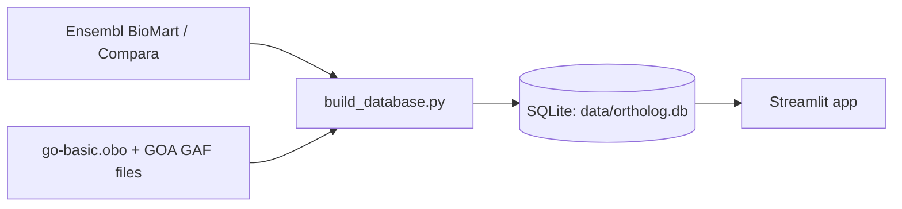

# Sophiark Orthology

**Compare a gene with its ortholog(s) between human and mouse.**
Orthology comes from Ensembl Compara, functional context from Gene Ontology annotations, and every number on the page is a transparent, set-based annotation overlap — never a claim of functional equivalence.


<!-- After deployment, add the live link here:  **Live app:** https://your-app.streamlit.app -->
<!-- Add a screenshot:  -->

> Codename inside the repository: *Ortholog Detective*.

---

## What it does

Type a human gene (or a mouse gene) and get:

1. **Orthology** — the ortholog(s) in the other species, the relationship type (1:1, 1:many, many:1, many:many), Ensembl's confidence flag, and any other genes that share the same ortholog.
2. **GO comparison** — for each ortholog pair, separately for **Biological Process**, **Molecular Function** and **Cellular Component**:
   - how many GO terms are shared, and how many appear on only one side,
   - the *annotation overlap* (Jaccard index, shown as a percentage),
   - every term as a card, with colour-coded evidence codes (experimental / inferred / author-curator / automatic).
3. **Honest empty states** — if one gene has no annotations in a category, the page says so ("data gap, not evidence of difference") instead of showing a misleading 0%.
4. **Data provenance** — the source versions and download dates are stored in the database and shown at the bottom of the page.

Everything runs from a local SQLite file. There are no external API calls while the app is running.

### Dataset at a glance (current build)

| | |
|---|---|
| Human gene records | 86,411 |
| Mouse gene records | 78,348 |
| Human ↔ mouse ortholog pairs | 25,788 |
| GO terms | 48,340 |
| Gene ↔ GO annotation rows | ~1.07 million |

Gene counts include every Ensembl gene biotype (many non-coding genes have no symbol).

---

## How to read the results

### Relationship types are derived from real gene counts

Ensembl labels each pair `one2one`, `one2many` or `many2many`, but the label does not say *which species* is the "many" side. The app therefore counts the genes itself, from the point of view of the gene you searched:

| Type | Meaning |
|---|---|
| **1:1** | one gene ↔ one gene |
| **1:many** | your gene has several orthologs; each is compared separately (one tab per ortholog) |
| **many:1** | your gene has one ortholog, but that ortholog is shared with other genes of your species |
| **many:many** | both |

Example: Ensembl labels human *FCGR3A* → mouse *Fcgr4* as `one2many`, yet there is only one mouse gene. The "many" side is human: *FCGR3A* and *FCGR3B* both map to *Fcgr4*. The app shows `many:1` and lists *FCGR3B* on the card. Ensembl's original label stays visible under the badge.

### Annotation overlap is not functional equivalence

> Annotation overlap reflects database annotations and should not be interpreted as evidence of functional equivalence.

The percentage is `|A ∩ B| / |A ∪ B|` over the GO terms recorded for the two genes. A missing annotation usually means "not yet curated", not "no such function". This tool is for exploring annotations. It does not establish function, causality, disease relevance or experimental validation.

---

## Quick start

Requires Python 3.10 or newer (tested on 3.11 and 3.12).

```powershell
python -m venv .venv
.venv\Scripts\Activate.ps1          # macOS/Linux: source .venv/bin/activate
pip install -r requirements.txt
```

**Try it immediately with a tiny synthetic dataset:**

```powershell
python scripts/seed_synthetic.py
streamlit run app.py
```

Search `GENEA` (1:1), `GENEB` (1:many) or `GENEC` (no ortholog).

**Use the real data:** build the database as described below. When `data/ortholog.db` exists, the app uses it automatically.

---

## Build the real database



```powershell
python scripts/download_orthology.py     # Ensembl orthology + gene tables -> data/raw/orthology/
python scripts/download_go.py            # go-basic.obo + human/mouse GAF  -> data/raw/go/
python scripts/build_database.py         # parse everything -> data/ortholog.db
streamlit run app.py
```

The build prints how many rows were loaded, how many GO annotation lines could not be matched to a gene, and the relationship types found in the data.

### If a download fails (network or server problems)

Download the files in a browser and place them in the folders below, then let the helper scripts verify them and write the manifests.

```text
data/raw/orthology/human_genes.tsv        data/raw/go/go-basic.obo
data/raw/orthology/mouse_genes.tsv        data/raw/go/goa_human.gaf.gz
data/raw/orthology/human_to_mouse.tsv     data/raw/go/goa_mouse.gaf.gz
data/raw/orthology/mouse_to_human.tsv
```

```powershell
python scripts/check_raw_files.py && python scripts/write_manifest.py        # orthology
python scripts/check_go_files.py  && python scripts/write_go_manifest.py     # GO
python scripts/build_database.py
```

`download_go.py` prints direct URLs for the GO files when it cannot fetch them. The four Ensembl files are tab-separated, without a header, exported from BioMart with these attributes:

| File | BioMart dataset | Attributes (in order) |
|---|---|---|
| `human_genes.tsv` | `hsapiens_gene_ensembl` | `ensembl_gene_id`, `external_gene_name`, `description` |
| `mouse_genes.tsv` | `mmusculus_gene_ensembl` | same |
| `human_to_mouse.tsv` | `hsapiens_gene_ensembl` | `ensembl_gene_id`, `external_gene_name`, `mmusculus_homolog_ensembl_gene`, `mmusculus_homolog_associated_gene_name`, `mmusculus_homolog_orthology_type`, `mmusculus_homolog_orthology_confidence` |
| `mouse_to_human.tsv` | `mmusculus_gene_ensembl` | the same, with `hsapiens_homolog_*` |

---

## Data sources

| Data | Source |
|---|---|
| Orthology | [Ensembl Compara](https://www.ensembl.org) via BioMart |
| Ontology | [Gene Ontology](https://geneontology.org) — `go-basic.obo` |
| Annotations | [GOA](https://www.ebi.ac.uk/GOA) human and mouse GAF files (UniProt-centric) |

Please cite and respect the terms of each source when you use results from this tool. Source versions and download dates are stored in the `metadata` table.

### Linking GO annotations to Ensembl genes

GOA files are keyed by UniProt accession, while orthology is keyed by Ensembl gene ID. Instead of maintaining a separate Ensembl ↔ UniProt table, the build step matches annotations to genes **by gene symbol** within the same species, and falls back to the GAF *synonym* column when the primary symbol differs. This matters in practice: current GOA lists mouse *Tp53* with *Trp53* as a synonym, while Ensembl calls the gene *Trp53*. The UniProt accession is stored on each gene once matched.

---

## Deploy for free (Streamlit Community Cloud)

The app only needs the code and one database file. The hosting platform starts from your Git repository, so the database has to travel with it.

1. **Package the database** (compacts it and writes `data/ortholog.db.gz`):

   ```powershell
   python scripts/package_database.py
   ```

   The script prints the compressed size.

2. **If it is under 90 MiB** (GitHub blocks single files above 100 MiB), commit `data/ortholog.db.gz` together with the code. On first start the app unpacks it.

   **If it is larger**, upload the `.gz` as an asset of a GitHub Release and add its download URL as a secret named `ORTHOLOG_DB_URL` in the app settings. The app downloads and unpacks it on first start.

3. Push the repository to GitHub, then on [share.streamlit.io](https://share.streamlit.io) create a new app: pick the repository, branch `main`, main file `app.py`.

Free hosting has resource limits and puts idle apps to sleep, so the first visit after a pause is slower. See Streamlit's documentation for the current limits.

Do not commit `data/raw/` or the uncompressed `data/ortholog.db` (both are in `.gitignore`).

---

## Project structure

```text
app.py                      Streamlit entry point
assets/                     logo
src/
  config.py                 paths and constants
  database/                 schema, connection, queries, first-start database preparation
  ingestion/                Ensembl orthology and GO parsers / loaders
  services/                 gene lookup, orthology, GO, pair comparison
  analysis/overlap.py       set-based overlap (Jaccard)
  ui/                       search box, result cards, GO panels, branding, styles
scripts/                    download, check, build, package and diagnostic scripts
tests/                      pytest suite (runs offline on a small synthetic dataset)
data/                       local data (not committed)
```

Database tables: `genes`, `orthologs`, `go_terms`, `gene_go`, `metadata` (plus `pathways` / `gene_pathways`, reserved for a later step).

### Diagnostic helpers

```powershell
python scripts/check_gene_annotations.py "Mus musculus" Trp53   # how many GO rows does this gene have?
python scripts/check_gene_orthologs.py FCGR3A                   # raw Ensembl rows vs. what is in the database
python scripts/grep_gaf.py goa_mouse.gaf.gz Trp53               # search the raw GAF file
python scripts/find_orthology_examples.py                       # real 1:many / many:many examples to try
```

---

## Tests

```powershell
pip install -r requirements-dev.txt
pytest
```

The tests cover orthology (1:1, 1:many, many:1, many:many, no ortholog), GO parsing and matching, overlap maths (including empty sets), the result-page HTML, database preparation and the full page rendering. They need no network access.

---

## Scope and limitations

- **Human ↔ mouse only.** The MVP deliberately stays small, transparent and reproducible.
- **Symbol-based matching.** Roughly 3–5% of GAF annotation lines could not be matched to an Ensembl gene in the current build. If several Ensembl rows share a symbol, the annotations are attached to all of them.
- **Annotation coverage is uneven.** Well-studied genes have far more annotations than others; compare overlap values with that in mind.
- **Evidence codes are shown, not filtered.** Automatic (IEA) annotations are included and marked as such.
- **Not implemented yet:** CSV/JSON export, Reactome pathway context, a one-command update pipeline.
- No AI/ML, protein structures, interaction networks, disease, drug or expression data — by design.

---

## Author

Developed by **Metin Kaan TEMİZER** — Founder / Developer at [Sophiark](https://sophiark.com.tr/), independent research software for computational biology and experimental work.

Try the other Sophiark tools: [Network Analysis](https://sophiark.com.tr/network-analysis/) · [Workplace](https://sophiark.com.tr/workplace/)

## License

MIT — see [LICENSE](LICENSE).
